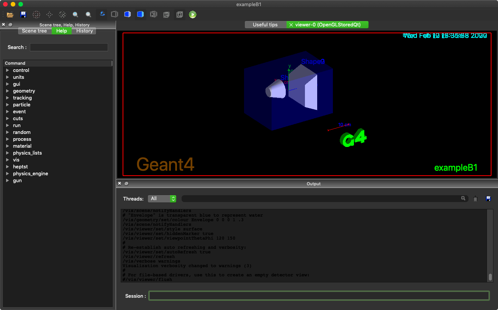

# あまりがんばらない Geant4 テンプレート

## はじめに

Geant4 を始めたいってひとは以下のアドレスのGeant4 講習会のページを見てください。

  - Geatn4 講習会 https://wiki.kek.jp/pages/viewpage.action?pageId=102763278

このページに大切なことは全部書いてあります。
究極的には、こことオフィシャルのマニュアル( https://geant4.web.cern.ch/support/user_documentation )を見てれば、だいたい書けると思います。

ただ、このページはとてもしっかり書いてあるので、読むだけでも一苦労です。
C++ を普段あんまり使っていないなら、だいぶしんどいのではないかと思います。
そうでなくてもクラスがいっぱいあって、自由度も高くて、何したらいいのかわからなくなります。

そういう人はこのテンプレートを使ってください。
このテンプレートのコンセプトを挙げておきます。

  - **両面ストリップ検出器( DSD )のシミュレーションのためのテンプレート**
  - **DSD のシミュレーションであれば、C++ に触れずに設定変更可** (セクション2を参照)
    - 入射光子のエネルギーや入射方向
    - 検出器の材質や厚さ、ストリップ幅、多層化など
  - **C++コードを改変したいときでも、変更箇所がわかりやすい** (セクション3以降)
    - クラスの数も、関数の数もできるだけ少なくした
    - その上ですべての箇所で具体的に書き方を示した
  - **Geant4 で準備されているクラスや関数をできるだけ使う**
  - **シミュレーション内では最低限の解析のみを行う**
    - 例えばエネルギーの値に乱数を加え、検出器の分解能相当に悪くする処理は行わない
    - こうした変換、処理は出力されたファイルを別のソフトで解析することを想定する

<details><summary> C++ に詳しい人向けのなにか </summary>

  - 上でも言っている通り、C++に詳しいあなたなら前述したページとあとはオフィシャルのクラスレファレンスを見れば、なんでも書けると思います。
  - Geant4 クラスをそのまま使うと煩雑になるところは新しく便利な関数を書いています。テンプレを使わずに書く場合は注意してください。
    - Ntuple 関連 : AnalysisManagesr で定義
    - マクロ用の Command 関連 : UImessenger で定義
  - 以下は今んとこ、ここでは扱わないので、ネットで調べてください。
    - Decay によるガンマ線, 光子以外の入射粒子, 並列化, 形状が複雑なジオメトリの定義, 電場 & 磁場, パラレルワールド...

</details></div>


---

## もくじ
<!-- TOC depthFrom:1 depthTo:6 withLinks:1 updateOnSave:1 orderedList:0 -->

- [あまりがんばらない Geant4 テンプレート](#-geant4-)
	- [はじめに](#)
	- [もくじ](#)
	- [1. インストール](#1-)
		- [1.1 Install by using Homebrew](#11-install-by-using-homebrew)
		- [1.2 Try an example](#12-try-an-example)
		- [1.3 特定のバージョンを入れる](#13-特定入)
	- [2. テンプレートをそのまま使う ~ C++にはさわらない ~](#2-使-c-)
		- [2.1 Installation](#21-installation)
		- [2.2 Settings of Particles](#22-settings-of-particles)
		- [2.3 Settings of Geometry](#23-settings-of-geometry)
		- [2.4 Settings of Output](#24-settings-of-output)
		- [2.5 Settings of Run](#25-settings-of-run)
	- [3. テンプレートを改変して使う - データ出力編 -](#3-改変使-出力編-)
		- [3.1 出力形式の定義](#31-出力形式定義)
			- [Opening and Closing Files](#opening-and-closing-files)
			- [Define a Ntuple](#define-a-ntuple)
				- [Define Columns](#define-columns)
			- [Define Histograms](#define-histograms)
		- [3.2 Fill Values in Columns](#32-fill-values-in-columns)
			- [3.2.1 Column with a single value](#321-column-with-a-single-value)
			- [3.2.2 Column with an array of values](#322-column-with-an-array-of-values)
		- [3.3 Save a row of Ntuple](#33-save-a-row-of-ntuple)
	- [4 テンプレートを改変して使う - 初期粒子編 -](#4-改変使-初期粒子編-)
	- [5 テンプレートを改変して使う - ジオメトリ編 -](#5-改変使-編-)
	- [6 テンプレートを改変して使う - 物理編 -](#6-改変使-物理編-)
	- [7 テンプレートを改変して使う - インターフェイス編 -](#7-改変使-編-)

<!-- /TOC -->


---

## 1. インストール

私の使っているコンピュータは Mac です。
Linux の人はがんばってインストールしてください。
example が動かせたら、セクション2に進んでください。

### 1.1 Install by using Homebrew

```
$ brew install geant4
```

Homebrew で入れたくないって人は、パスとかわかってるでしょうから、以下では適当に置き換えてください。

次に進んで、example を動かしてみて、大丈夫だったら大丈夫です。
ダメだったら 1.3 を見てください。

あとセクション2以降ではROOTも必要なので、同様に入れといてください。
```
 $ brew install root
```

### 1.2 Try an example

どこかに作業ディレクトリを作る。

```
mkdir ~/Work/geant4/example_test
cd ~/Work/geant4/example_test
```

example のコードをコピーする(バージョンの番号 10.5.0 のところは適宜変えてください)。
build ディレクトリを作って、そこでコンパイルする。

```
cp -r /usr/local/share/Geant4-10.5.0/examples/basic/B1 .
cd B1
mkdir build
cd build
cmake ../
make install -j
```

インストールできたら、ソフトを起動すると、図のような何かが表示されるはずです。

```
 $ exampleB1
```

<div align="center">

</div>

終了するときは、ウインドウ下の`Session:`に exit コマンドを入力する or Command+Q を押してください。

```
 Session: exit
```

マクロ( .mac ファイル)でシミュレーションをランする場合は、以下のようにしましょう。

```
 $ exampleB1 run1.mac
```
この場合は自動的にソフトは終了します。結果が画面に表示されているはず。この example だと出力ファイルなどは特にありません。

### 1.3 特定のバージョンを入れる

基本的には問題ないと思いますが、たまに最新バージョンが Xcode のバージョンと相性が悪くてダメな場合があります。
がんばって、少し古いよさげなバージョンの Geant4 をインストールしてください。
Homebrew を使ってできるはずです。

---

## 2. テンプレートをそのまま使う ~ C++にはさわらない ~

### 2.1 Installation

ディレクトリをコピーする。

```
cd workdir
cp -r /path/to/template/G4DSDtemplate .
cd G4DSDtemplate
```

build ディレクトリを作って、コンパイルとインストールをする。

```
mkdir build
cd build
cmake ../
make install -j
```

動かす。ジオメトリを可視化するなら、

```
g4-dsd
```

シミュレーションを走らせるなら、

```
g4-dsd testrun.mac
```

これでうまくいけば、OK。
次のサブセクションからは、マクロを変更することでシミュレーションの設定を変更する方法を説明します。
既存のマクロから変更後、同様にして走らせてください。
以下に挙げるコマンドの書き方に注意して、使い方を確認しましょう。

**Geant4 マクロのコマンドの特徴**
- シャープ(#)以下がコメントになる
- 文字列にクォーテーションは不要
- 単位が指定できる場合が多い
- ディレクトリ構造がある

```shell
/path/of/command/ Arg1 Arg2 3. 4 ... # THIS IS A COMMENT
```

### 2.2 Settings of Particles

より複雑な変更はセクション4を参照。

```shell
/gun/particle gamma           # (Type)          # 粒子の種類を変更
/gun/energy 3000 keV          # (E, Unit)       # エネルギーを変更
/gun/position -5. 0. 0.5. cm  # (X, Y, Z, Unit) # 始点を変更
/gun/direction 1. 0. 0.       # (X, Y, Z)       # 方向を変更
```

### 2.3 Settings of Geometry

ワールドの設定
```shell
/myapp/geom/setLengthOf worldSize 1000 mm  # (Key, Value, Unit)
```

検出器の設定
```shell
/myapp/geom/setLengthOf detectorSize 32 mm            # (Key, Value, Unit)
/myapp/geom/setLengthOf detectorThickness 750 um      # (Key, Value, Unit)
/myapp/geom/setLengthOf detectorGap 4 mm
/myapp/geom/setPositionOf detectorCenter 0. 0. 0. mm  # (Key, X, Y, Z, Unit)
```


### 2.4 Settings of Output

より複雑な変更はセクション3を参照。

```shell
/analysis/setFileName gamma          # (Name)                       # 出力ファイル名(.rootの前)を変更
/analysis/h1/set 0 100 0. 100. keV   # (ID, Nbins, Min, Max, Unit)  # ヒストグラムの設定
```


### 2.5 Settings of Run

以下のコマンドで指定した回数分シミュレーションが実行されます。
シミュレーションが始まると他の設定変更はできないので、マクロの最後に書きましょう。

```shell
/run/beamOn 10　　　　　　　　# (N)             # 粒子数を変更
```


---

## 3. テンプレートを改変して使う - データ出力編 -

Geant4 の出力結果になんらかの処理をした情報を保存したくなるときがあると思います。
とりあえずテンプレートで行っている情報の処理は以下の通り。
  - 粒子の反応位置からストリップ番号およびピクセル番号を対応させる
  - 同じく反応位置から検出器番号を対応させる(多層検出器の場合に便利)

### 3.1 出力形式の定義

出力内容を変更するなら、ファイルに保存されるツリーのブランチやヒストグラムの定義を変更することになるかと思います。
以下では、Geant4 の言い方に倣って、Ntuple (=ツリー)、Column (=ブランチ)と言います。

#### Opening and Closing Files

はじめにファイルの生成から閉じるまでの説明をします。変更の必要のない人は飛ばしてください。
ファイルの定義は`RunAction::RunAction`で以下のように行います。

```c++
RunAction::RunAction()
    : G4UserRunAction()
{
    auto analysis_manager = AnalysisManager::Instance();

	analysis_manager->SetActivation(true);
	// マクロで Histogram の activate を行えるようにしたい場合に以下のように `true` にします

    analysis_manager->SetVerboseLevel(1);
	// メッセージのうるささを設定します

    analysis_manager->SetFileName("test");
	// この場合、出力ファイルの Default 名は `test.root` になります
}
```

ファイルを開くときと閉じるときは Run のはじめとおわりに以下のようにします。
あまり変更する場合はないような気がするので、特に説明はしません。

```c++
void RunAction::BeginOfRunAction(const G4Run*)
{
    auto analysis_manager = AnalysisManager::Instance();
    analysis_manager->OpenFile();
}
```

```c++
void RunAction::EndOfRunAction(const G4Run*)
{
    auto analysis_manager = AnalysisManager::Instance();
    analysis_manager->Write();
    analysis_manager->CloseFile();
}
```

#### Define a Ntuple

本テンプレートでは、Ntuple の定義を `RunAction::BeginOfRunAction` で行なっています。
例えば、Ntuple のとても短い定義は以下のようになります。

```c++
void RunAction::BeginOfRunAction(const G4Run*)
{
    auto analysis_manager = AnalysisManager::Instance();
    analysis_manager->OpenFile();

    analysis_manager->CreateNtuple("tree", "tree_title");
	// Ntuple の名前とタイトルを指定して、定義します。

    analysis_manager->CreateNtupleIColumn("nhits");
    analysis_manager->CreateNtupleDColumnV("edep", 32);

    analysis_manager->FinishNtuple();
	// 最後に必ず、`FinishNtuple`を呼び出して、Ntuple の定義を終了してください
}
```

**`FinishNtuple`の実行は忘れずに!**

##### Define Columns

配列でない Column を定義する場合、`CreateNtupleXColumn`を使ってください。
X に入る文字は、 I (整数、int)、D (double), F (float), S (文字列)の4パターンです。
```c++
analysis_manager->CreateNtupleIColumn("nhits");
```

配列は以下のように `CreateNtupleXColumnV`を使って、定義してください。
その際、配列の最大値(以下の例でいうところの 32 )を指定してください。
ROOTファイルに出力した場合、std::vector を使った Branch が生成されます。

```c++
analysis_manager->CreateNtupleDColumnV("edep", 32);
```
今の所、Geant4 に用意されているクラスを使う限りでは、通常の配列を使った Column を(固定長、可変長問わず)生成することはできません。
本テンプレートでは、この2種類の Column でなんとかすることにします。


#### Define Histograms

ヒストグラムの定義は `RunAction::RunAction` の中で行います。

```c++
RunAction::RunAction()
    : G4UserRunAction()
{
    auto analysis_manager = AnalysisManager::Instance();
    analysis_manager->SetActivation(true);

    G4int id = analysis_manager->CreateH1("spect","title", 100, 0., 100.);
    analysis_manager->SetH1Activation(id, false);
	// 定義したときの戻り値が、ヒストグラムを示すIDになる
	// ID は定義した順に 0 から振られ、この例では id = 0 となる
}
```

実行するマクロで 振られた ID を使って activate できます。

```sh
 /analysis/h1/set 0 100 0. 100. keV
```

### 3.2 Fill Values in Columns

#### 3.2.1 Column with a single value

配列でない Column の場合、各イベントの終わりに `FillNtupleXColumnName` を呼び出して値を入れます (X = I, F, D or S) 。

```c++
analysis_manager->FillNtupleXColumnName( "column_name", value );
```

使い方の例。 `nhits` という整数の Column に値を詰める場合。

```c++
void SensitiveDetector::EndOfEvent( G4HCofThisEvent* )
{
	int nhits = ....
    auto analysis_manager = AnalysisManager::Instance();
    analysis_manager->FillNtupleIColumnName("nhits", nhits);
}
```
#### 3.2.2 Column with an array of values

配列の Column の場合、`SensitiveDetector::ProcessHits` の中で値を Fill します。
`ProcessHits` は粒子が検出器内でなにか反応するたびに ( Geant4 ではこれを Step と言います ) 呼び出される関数です。

```c++
G4bool SensitiveDetector::ProcessHits( G4Step* step, G4TouchableHistory* )
{
	G4double edep = step->GetTotalEnergyDeposit();
	// この Step のエネルギーデポジットを得る

	analysis_manager->FillNtupleDColumnVName( "edep", edep );
	// `edep` という Column に値を詰める
}
```


### 3.3 Save a row of Ntuple

本テンプレートでは、Ntuple の出力を各イベントごとに保存しています (つまり出力された Ntuple の1エントリーが 1 イベントに対応)。
この場合、イベントのはじめとおわりに以下の手続きを行う必要があります。

イベントのはじめに、準備した配列をクリアするために `AnalysisManager::ClearNtupleVector` を呼び出す。
```c++
void EventAction::BeginOfEventAction(const G4Event*)
{
    auto analysis_manager = AnalysisManager::Instance();
    analysis_manager->ClearNtupleVector();
}
```

イベントのおわりに `AnalysisManager::AddNtupleRow` を呼び出し、SensitiveDetector などでフィルした値をツリーに保存する。

```c++
void EventAction::EndOfEventAction(const G4Event*)
{
    auto analysis_manager = AnalysisManager::Instance();
    analysis_manager->AddNtupleRow();
}
```

あまり必要とは思えないですが、ステップごとに保存するように変更したい場合は EventAction に記述されている以下の手順を SteppingAction に移すとよい(と思います、確かめてない)。

---

## 4 テンプレートを改変して使う - 初期粒子編 -

---

## 5 テンプレートを改変して使う - ジオメトリ編 -

---

## 6 テンプレートを改変して使う - 物理編 -

クラス `PhysicsList` に変更を加える。

```c++
PhysicsList::PhysicsList()
    :G4VModularPhysicsList()
{
    this->RegisterPhysics( new G4EmLivermorePhysics );
}
```


`PhysicsList` では Cut の距離を設定することができる。
2次粒子のうち、これより短い距離で停止した粒子は追わない。

```c++
void PhysicsList::SetCuts()
{
    this->SetDefaultCutValue(0.1*mm);
}
```


---

## 7 テンプレートを改変して使う - インターフェイス編 -
`UImessenger` を変更する。

```c++
UImessenger::UImessenger()
    :G4UImessenger(),
     homedir(nullptr),
     detector_construction(nullptr)
{
    this->homedir = new G4UIdirectory( "/myapp/" );
    this->homedir->SetGuidance( "Commands specific to this app" );

    word = new G4UIcmdWithAString( "/myapp/setName", this );
    word->SetGuidance( "nandemo iiyo" );
    word->SetParameterName( "your_choice", true );
    word->AvailableForStates( G4State_PreInit, G4State_Idle );
    word->SetToBeBroadcasted( false );

    world_size
        = new G4UIcmdWithADoubleAndUnit( "/myapp/setWorldSize", this );
    world_size->SetGuidance( "Size of world" );
    world_size->SetParameterName( "Thick", true, true );
    world_size->SetRange( "Size>0.0" );
    world_size->SetDefaultUnit( "mm" );
    world_size->SetUnitCategory( "Length" );
    world_size->AvailableForStates( G4State_PreInit, G4State_Idle );
    world_size->SetToBeBroadcasted( false );

    det_command = new G4UIcmdWithAKeyAndADouble( "/myapp/setDetLength", this );
    det_command->SetGuidance( "" );
    det_command->SetKeyCandidate( "size thick gap" );

}
```
