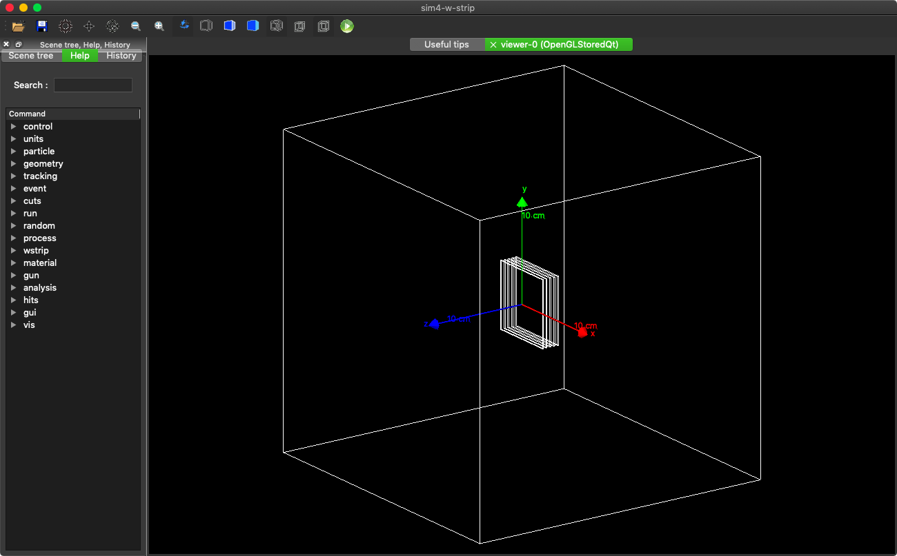

# 両面ストリップ検出器シミュレーション by Geant4


## Introduction

このテンプレートコードの特徴は以下の通りです。

  - **両面ストリップ検出器( DSD )のシミュレーションがすぐ始められるテンプレートコード**
  - DSDのシミュレーションであれば、**C++ に触れずに設定変更可**
    - 入射光子のエネルギーや入射方向
    - 検出器の材質や厚さ、ストリップ幅、多層化など
  - 自分なりのシミュレーターにしたいときも、**とっつきやすいC++コード**
    - 変更が想定されるすべての箇所について具体的な解説つき
    - そもそもコード全体がコンパクト
  - **Geant4 で準備されているクラスや関数をできるだけ使っている**
    - ピュアな Geant4 に移行しやすい
    - 例外は ROOT 関連と UI 関連の一部 -> 同じく詳細に解説
  - シミュレーションで **得られた情報をそのまま出力**
    - 詳細な解析、複雑な処理は出力後に別ソフトで解析する想定
    - 例外は、光子反応位置に対応する検出器やストリップ、ピクセルのIDの出力


**参考文献**

本ドキュメントに書いてあることはだいたい下の2つにたぶん書いてあります。
C++ をゴリゴリ書く人なら、こっちを直接見た方が早いかもしれません。

  - Geant4 講習会 https://wiki.kek.jp/pages/viewpage.action?pageId=102763278
  - Geant4 公式マニュアル https://geant4.web.cern.ch/support/user_documentation


---

[TOC]

------


# 1. インストール

本コードでは、Geant4 と ROOT 、そしてそれらに必要なライブラリ郡を Homebrew を通じてインストールしたことを想定している。

```shell
 $ brew install geant4
 $ brew install root
```

Geant4 と ROOT がインストールできたら、以下を実行する。

```
 $ git clone https://github.com/goroyabu/sim4-w-strip
 $ cd sim4-w-strip
```

build ディレクトリを作って、コンパイルとインストールをする。

```shell
 $ mkdir build
 $ cd build
 $ cmake ../
 $ make install -j
```


---


# 2. 使い方

## GUI を開く

インストールが無事に完了したら、以下のコマンドでアプリケーションを起動すると、ウインドウが開き、GUIセッションがスタートする。

```shell
 $ sim4-w-strip
```


ウインドウ下部の `Session:` に Geant4 コマンドを入力することで様々な操作ができる。ここではマクロを読み込んで、検出器を可視化してみる。

```shell
Session: /control/execute vis_geom.mac
```

`/control/execute` はマクロを実行するコマンドで、 `vis_geom.mac` がマクロのファイル名である。実行するとワールド内に5枚の検出器が表示されるはず。向きや大きさをマウスで操作できる。





ソフトを終了するときは、

```
Session : exit
```

を入力するか、ウインドウをバツ印で消すか、コマンド+Qを押す。


## マクロでシミュレーションを実行する

GUI を使わずに、コマンドを記述したマクロを引数に指定すれば、それを読み込んで実行することができる。シミュレーションのテストランができるマクロを実行する。

```shell
 $ sim4-w-strip gamma_test.mac
```

終了後、同じディレクトリに `result_gamma.root` が生成されているはずである。

ROOT のマクロを実行して、スペクトルを書く。これはイベントごとの各検出器でのエネルギー合計値を詰めたヒストグラムである。

``` sh
 $ root result_gamma.root draw.C
```


## マクロの解説と設定変更

本コードではマクロによる設定変更で DSD を使った様々なシミュレーションが行えることを目指している。Geant4 ですでに用意されているコマンドにも多くの種類があるので、ここではシミュレーション内容に直接関連する本コードオリジナルのコマンドを中心に説明を行う。なおマクロ全体は本項の最後に載せている。


**Geant4 マクロのコマンドの特徴**

- シャープ(#)以下がコメントになる
- 文字列にクォーテーションは不要
- 単位が指定できる場合が多い
- ディレクトリ構造がある

```shell
/path/of/command/ Arg1 Arg2 3. 4 cm # THIS IS A COMMENT
```


### ジオメトリの設定

DSDを定義するには、コマンド `/wstrip/geom/addDetectorLayer` を必要分呼び出せばよい。各 DSD には定義された順に検出器番号 ( detid ) が振られる ( N-tuple の column を参照 ) 。例えば、単層のCdTe-DSDの場合、

```shell
/wstrip/geom/addDetectorLayer CdTe 750 um
```

また、Si 検出器が2層、CdTe 検出器が3層のコンプトンカメラの場合、以下のようになる。

```shell
/wstrip/geom/addDetectorLayer Si   500 um # detid = 0
/wstrip/geom/addDetectorLayer Si   500 um
/wstrip/geom/addDetectorLayer CdTe 750 um
/wstrip/geom/addDetectorLayer CdTe 750 um
/wstrip/geom/addDetectorLayer CdTe 750 um # detid = 4
```

長さを指定するときは、 `/wstrip/geom/setLengthOf` コマンドを使う。

```shell
/wstrip/geom/setLengthOf  worldSize      15    cm  # ワールドの 1 辺
/wstrip/geom/setLengthOf  detectorSize   32.0  mm  # DSD の 1 辺
/wstrip/geom/setLengthOf  detectorGap    4     mm  # DSD 間のギャップ
```

ジオメトリを設定後、初期化を行い、確定させる。このコマンドは元々 Geant4 で用意されているものである。

```shell
/run/initialize
```


 `gamma_test.mac` 

```sh
##################################################
### Verbose
##################################################

/control/verbose 2
/run/verbose 2

##################################################
## Geometry
##################################################

/wstrip/geom/setLengthOf  worldSize      15    cm

/wstrip/geom/setLengthOf  detectorSize   32.0  mm
/wstrip/geom/setLengthOf  detectorGap    4     mm

#/wstrip/geom/setPositionOf detectorCenter 0. 0. 0. mm

/wstrip/geom/addDetectorLayer Si 500 um
/wstrip/geom/addDetectorLayer Si 500 um
/wstrip/geom/addDetectorLayer CdTe 750 um
/wstrip/geom/addDetectorLayer CdTe 750 um
/wstrip/geom/addDetectorLayer CdTe 750 um

/run/initialize

##################################################
### ParticleGun 
##################################################

/gun/particle  gamma        # (Type)          # 粒子の種類
/gun/energy    511.0 keV    # (E, Unit)       # エネルギー
/gun/position  0. 0. 1. mm  # (X, Y, Z, Unit) # 始点 
/gun/direction 0. 0. -1.    # (X, Y, Z)       # 方向      

##################################################
### Analysis
##################################################

/analysis/setFileName result_gamma # (Name) # 出力ファイル名(.rootの前) 

##################################################
### Run
##################################################

/run/setCut 100 um # 
/run/beamOn 100000

#------------------------------------------------
```


---


# 3. データ形式

計算結果は ROOT ファイルに Tree で出力される。以下ではより一般的な呼称として N-tuple (=Tree)、 Column (=Branch) を用いる。各 Column の名称、形式を一覧に示す。 ちなみに Geant4 で用意されている枠組みでは、データ型は int, float, double と string の 4 種のみで、配列は 固定長、可変長に関わらず、全て std::vector を使った Column として出力される。


## Column 一覧

| Column 名 | データ型         | サイズ | 説明                     |
| --------- | ---------------- | ------ | ------------------------ |
| nhits     | int              | 1      | 検出した反応の数         |
| detid     | vector< int >    | nhits  | 検出器番号               |
| strip_x   | vector< int >    | nhits  | X-side の ストリップ番号 |
| strip_y   | vector< int >    | nhits  | Y-side の ストリップ番号 |
| edep      | vector< double > | nhits  | エネルギー ( keV )       |
| pos_x     | vector< double > | nhits  | 反応の X 位置            |
| pos_y     | vector< double > | nhits  | 反応の Y 位置            |
| pos_z     | vector< double > | nhits  | 反応の Z 位置            |


## データ処理

前述したコンセプトの通り、本コードでは Geant4 が得られたデータを極力そのまま出力することにしているが、シミュレーション内容によらず普遍性が高いと考えられ、別ソフトを使って後処理をする方がかえって煩雑となる部分に関して一部データの処理を行った。本項では、それらの箇所について説明をする。

### 検出器・ストリップ番号の付与

粒子の反応が生じた位置から対応する検出器番号とストリップ番号を付与している。

### 同一ピクセルでの反応の扱い

同一ピクセルで連続して生じた反応を１つの反応に結合 (マージ?) している。

現在の結合方法は、以下の通りである。

- 結合後のエネルギー (edep)  = 各反応のエネルギー合計値
- 結合後の反応位置 (pos_x-z)  = エネルギーが最大の反応位置

結合後のエネルギー・位置情報の決定は他の方法も考えられる (最後の反応の位置を結合後の位置にするなど)。また、隣接するピクセルの反応まで結合させることも検討している。いずれにせよ、コマンドによる選択が可能なようにする予定。


# 4. ファイル構成

Geant4 は非常に多くのツールを持った、自由度が高いライブラリである。それゆえにビギナーがコードを書き始める際には、全体を把握することや手を付けはじめるのが難しい。本テンプレートコードでは、最低限のファイル数でコンパクトな構成を心がけた。

以下に本コードのファイル構成をディレクトリ構成とともに示した。分かりやすさのために、ヘッダーファイル (.cpp ファイルと同名の .hpp ファイル) は省略している。

```bash
                                            ### o=ユーザーが定義する可能性のあるクラス ###
.
├── action_initialization                   # アクション関連 #      
│   ├── ActionInitialization.cpp            #   # ユーザーアクション(~Action)を設定するクラス
│   ├── AnalysisManager.cpp                 #   # Ntuple, Histogram を定義するためのクラス
│   ├── EventAction.cpp                     # o # イベントごとに行う処理を記述するクラス
│   ├── PrimaryGeneratorAction.cpp          # o # 初期粒子を発生させるクラス
│   ├── RunAction.cpp                       #   # ランの始めと終わりに行う処理を記述するクラス
│   └── SteppingAction.cpp                  # o # 反応のステップごとに行う処理を記述するクラス
│
├── detector_construction                   # 検出器関連 #                 
│   ├── DetectorConstruction.cpp            # o # ジオメトリを定義するクラス
│   ├── HitsCollection.cpp                  #   # 検出器の信号を格納するクラス
│   └── SensitiveDetector.cpp               # o # 検出器内で反応が起きたときの処理を記述するクラス
│
├── physics_list                            # 物理法則の定義 #
│   └── PhysicsList.cpp                     # o # 物理法則を定義するクラス
│
├── user_interface                          # UI 関連 #
│   ├── UIcmdWithCustomizableArguments.cpp  #   # UIコマンドを受け取るためのクラス
│   └── UImessenger.cpp                     # o # UIコマンドに応じて他のクラスに指示するクラス
│
└── main.cpp                                #   # メイン関数
```

　　　　　　　　　　　　　　　　　　　

## i. 主要な 3 つのクラス

一覧に列挙したクラスのうち、ActionInitialization, DetectorConstruction, PhysicsList の 3 つは Geant4 アプリケーションを動かすために重要なクラスであり、メイン関数から直接呼び出している。

### ActionInitialization

ActionInitialization は ~Action クラスを内部に持っているクラスである。各 Action クラスは、所定の関数に処理を書いておくと、決まったタイミングでそれを実行するクラスであり、いくつかの種類がある。例えば、`RunAction` の `RunAction::BeginOfRunAction` はランの始めに実行される関数である。

**User Action を記述するクラス** 

| クラス名               | 仕事をするタイミング   | 仕事内容の例                                  |
| ---------------------- | ---------------------- | --------------------------------------------- |
| RunAction              | ランの始めと終わり     | ファイルの開閉、N-tupleの定義                 |
| EventAction            | イベントの始めと終わり | N-tuple の Row の追加                         |
| SteppingAction         | 反応のステップごと     | 反応の情報の取得 (ただし本コードではしてない) |
| PrimaryGeneratorAction | イベントの最初         | 初期粒子の発生、これがないと何も始まらない    |


### DetectorConstruction

DetectorConstruction は "Detector" と名前がついているが検出器の素子だけでなく、コリメータや周囲の物体、雰囲気まで実験環境全体 (ジオメトリ?) を定義するクラスである。Geant4 では実際の実験環境を再現するような複雑なジオメトリを記述できるよう、材質や形状などを表す多くの種類のクラスが用意されている 。

**ジオメトリを記述するクラス**

| クラス名          |                                                              |
| ----------------- | ------------------------------------------------------------ |
| G4CSGSolid        | 形状. 具体的には G4Box (箱型), G4Tubs (円柱) などを使う      |
| G4Material        | 材質.                                                        |
| G4LogicalVolume   | 材質 (Material) と形状 (Solid) を内部に持つ                  |
| G4PVPlacement     | 物体 (LogicalVolume) と置かれ方 (位置 + 向き) の情報を持つ   |
| SensitiveDetector | 物体 (LogicalVolume) を検出器にする. 粒子を検出すると `ProcessHits` が呼ばれる |

また、検出器素子として定義した物体内で粒子が反応したとき、その情報を簡単に取り出す手段として SensitiveDetector が用意されている。これは前述の Action クラスと同様に、`SensitiveDetector` の `SensitiveDetector::ProcessHits` に粒子のエネルギーや位置情報を取り出して保存するように記述しておけば、シミュレーション中に粒子の反応を自動的に検出し、関数を呼び出す。クラス HitsCollection は SensitiveDetector が反応の情報を一時的に格納するのに使う。


 ### PhysicsList

PhysicsList は物理法則を記述するクラスである。 本当はどの物理過程を自分のシミュレーションに取り入れるかひとつひとつ考える必要があるが、とりあえず低いエネルギーの光子の反応が記述されているらしい `G4EmLivermorePhysics` を使っている。


## ii. その他のクラス

以下の 2 つのクラスはシミュレーション内容に直接影響しないクラスであるため、本コードを使う人はいたとしても必ずしも内容を把握しておく必要性はない。そのため本項では、コードを書き換えてより発展的なシミュレーションをするユーザー向けに説明を行う。

ここまでのクラスでは Geant4 を動かすのに必要な手続きがわかりにくくならないように、できるだけ関数の数を増やさずに素直な記述をしたりしていた。しかし、この 2 つのクラスでは記述を簡便にするための実装を行っている。

### AnalysisManager

AnalysisManager は N-tuple と Histogram を定義を行うクラスで、Geant4 のクラスである G4RootAnalysisManager を継承している。 このクラスで実装した機能は大きく分けて 2 つあり、 1 つは Column へのアクセスを文字列で行えるようにしたことと、もう 1 つは 、配列の Column を定義するクラスとは別のクラスが Fill できるようにしたことである。

### UImessenger

UImessenger は マクロ or GUI での操作で用いるコマンドを定義、処理するクラスである。 

#### UIcmdWithCustomizableArguments

コマンドを定義する UIcommand を継承したクラス。任意の引数の定義し、入力された値を取得することを簡便に行えるクラス。

